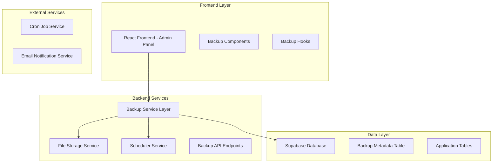
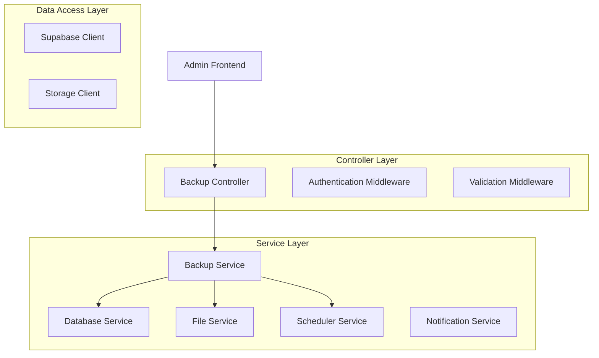
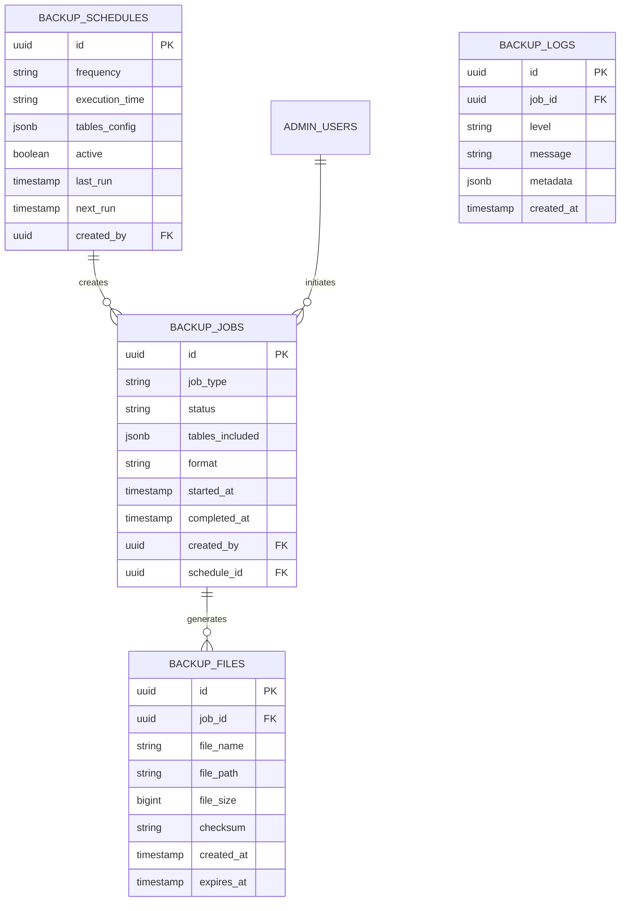

# Funcionalidade de Backup do Banco de Dados - Arquitetura Técnica

## 1. Arquitetura do Sistema



## 2. Descrição das Tecnologias

- **Frontend**: React@18 + TypeScript + Tailwind CSS + Lucide React
- **Backend**: Supabase (PostgreSQL) + Edge Functions
- **Armazenamento**: Supabase Storage para arquivos de backup
- **Agendamento**: Supabase Edge Functions com cron jobs
- **Notificações**: Supabase Auth + Email templates

## 3. Definições de Rotas

| Rota | Propósito |
|------|-----------|
| `/admin/configuracoes/backup` | Página principal de backup na seção de configurações |
| `/admin/configuracoes/backup/manual` | Interface para backup manual |
| `/admin/configuracoes/backup/agendamento` | Configuração de backups automáticos |
| `/admin/configuracoes/backup/historico` | Histórico de backups realizados |
| `/admin/configuracoes/backup/restauracao` | Interface de restauração de dados |

## 4. Definições de API

### 4.1 APIs Principais

**Geração de Backup Manual**
```
POST /api/backup/generate
```

Request:
| Parâmetro | Tipo | Obrigatório | Descrição |
|-----------|------|-------------|-----------|
| tables | string[] | true | Lista de tabelas para backup |
| format | string | true | Formato do backup (sql, json, csv) |
| compression | boolean | false | Aplicar compressão ao arquivo |

Response:
| Parâmetro | Tipo | Descrição |
|-----------|------|-----------|
| success | boolean | Status da operação |
| backup_id | string | ID único do backup gerado |
| download_url | string | URL para download do arquivo |
| file_size | number | Tamanho do arquivo em bytes |

Exemplo:
```json
{
  "tables": ["products", "categories", "subcategories"],
  "format": "sql",
  "compression": true
}
```

**Configuração de Agendamento**
```
POST /api/backup/schedule
```

Request:
| Parâmetro | Tipo | Obrigatório | Descrição |
|-----------|------|-------------|-----------|
| frequency | string | true | Frequência (daily, weekly, monthly) |
| time | string | true | Horário de execução (HH:MM) |
| tables | string[] | true | Tabelas para backup automático |
| active | boolean | true | Status do agendamento |

Response:
| Parâmetro | Tipo | Descrição |
|-----------|------|-----------|
| success | boolean | Status da operação |
| schedule_id | string | ID do agendamento criado |
| next_execution | string | Data/hora da próxima execução |

**Histórico de Backups**
```
GET /api/backup/history
```

Request:
| Parâmetro | Tipo | Obrigatório | Descrição |
|-----------|------|-------------|-----------|
| page | number | false | Página para paginação |
| limit | number | false | Itens por página |
| date_from | string | false | Data inicial do filtro |
| date_to | string | false | Data final do filtro |

Response:
| Parâmetro | Tipo | Descrição |
|-----------|------|-----------|
| backups | array | Lista de backups |
| total | number | Total de backups |
| page | number | Página atual |
| total_pages | number | Total de páginas |

**Restauração de Dados**
```
POST /api/backup/restore
```

Request:
| Parâmetro | Tipo | Obrigatório | Descrição |
|-----------|------|-------------|-----------|
| backup_id | string | true | ID do backup para restaurar |
| tables | string[] | false | Tabelas específicas para restaurar |
| confirm | boolean | true | Confirmação da operação |

Response:
| Parâmetro | Tipo | Descrição |
|-----------|------|-----------|
| success | boolean | Status da operação |
| restored_tables | string[] | Tabelas restauradas |
| affected_rows | number | Número de registros afetados |

## 5. Arquitetura do Servidor



## 6. Modelo de Dados

### 6.1 Definição do Modelo de Dados



### 6.2 DDL (Data Definition Language)

**Tabela de Jobs de Backup**
```sql
-- Criar tabela de jobs de backup
CREATE TABLE backup_jobs (
    id UUID PRIMARY KEY DEFAULT gen_random_uuid(),
    job_type VARCHAR(50) NOT NULL CHECK (job_type IN ('manual', 'scheduled')),
    status VARCHAR(20) NOT NULL DEFAULT 'pending' CHECK (status IN ('pending', 'running', 'completed', 'failed')),
    tables_included JSONB NOT NULL,
    format VARCHAR(10) NOT NULL DEFAULT 'sql' CHECK (format IN ('sql', 'json', 'csv')),
    compression BOOLEAN DEFAULT false,
    started_at TIMESTAMP WITH TIME ZONE,
    completed_at TIMESTAMP WITH TIME ZONE,
    error_message TEXT,
    created_by UUID NOT NULL REFERENCES admin_users(id),
    schedule_id UUID REFERENCES backup_schedules(id),
    created_at TIMESTAMP WITH TIME ZONE DEFAULT NOW(),
    updated_at TIMESTAMP WITH TIME ZONE DEFAULT NOW()
);

-- Criar tabela de arquivos de backup
CREATE TABLE backup_files (
    id UUID PRIMARY KEY DEFAULT gen_random_uuid(),
    job_id UUID NOT NULL REFERENCES backup_jobs(id) ON DELETE CASCADE,
    file_name VARCHAR(255) NOT NULL,
    file_path TEXT NOT NULL,
    file_size BIGINT NOT NULL,
    checksum VARCHAR(64),
    download_count INTEGER DEFAULT 0,
    created_at TIMESTAMP WITH TIME ZONE DEFAULT NOW(),
    expires_at TIMESTAMP WITH TIME ZONE
);

-- Criar tabela de agendamentos
CREATE TABLE backup_schedules (
    id UUID PRIMARY KEY DEFAULT gen_random_uuid(),
    name VARCHAR(100) NOT NULL,
    frequency VARCHAR(20) NOT NULL CHECK (frequency IN ('daily', 'weekly', 'monthly')),
    execution_time TIME NOT NULL,
    execution_day INTEGER, -- Para backups semanais/mensais
    tables_config JSONB NOT NULL,
    format VARCHAR(10) NOT NULL DEFAULT 'sql',
    compression BOOLEAN DEFAULT false,
    retention_days INTEGER DEFAULT 30,
    active BOOLEAN DEFAULT true,
    last_run TIMESTAMP WITH TIME ZONE,
    next_run TIMESTAMP WITH TIME ZONE,
    created_by UUID NOT NULL REFERENCES admin_users(id),
    created_at TIMESTAMP WITH TIME ZONE DEFAULT NOW(),
    updated_at TIMESTAMP WITH TIME ZONE DEFAULT NOW()
);

-- Criar tabela de logs
CREATE TABLE backup_logs (
    id UUID PRIMARY KEY DEFAULT gen_random_uuid(),
    job_id UUID REFERENCES backup_jobs(id) ON DELETE CASCADE,
    level VARCHAR(10) NOT NULL CHECK (level IN ('info', 'warning', 'error')),
    message TEXT NOT NULL,
    metadata JSONB,
    created_at TIMESTAMP WITH TIME ZONE DEFAULT NOW()
);

-- Criar índices para performance
CREATE INDEX idx_backup_jobs_status ON backup_jobs(status);
CREATE INDEX idx_backup_jobs_created_by ON backup_jobs(created_by);
CREATE INDEX idx_backup_jobs_created_at ON backup_jobs(created_at DESC);
CREATE INDEX idx_backup_files_job_id ON backup_files(job_id);
CREATE INDEX idx_backup_schedules_active ON backup_schedules(active);
CREATE INDEX idx_backup_schedules_next_run ON backup_schedules(next_run) WHERE active = true;
CREATE INDEX idx_backup_logs_job_id ON backup_logs(job_id);
CREATE INDEX idx_backup_logs_created_at ON backup_logs(created_at DESC);

-- Configurar RLS (Row Level Security)
ALTER TABLE backup_jobs ENABLE ROW LEVEL SECURITY;
ALTER TABLE backup_files ENABLE ROW LEVEL SECURITY;
ALTER TABLE backup_schedules ENABLE ROW LEVEL SECURITY;
ALTER TABLE backup_logs ENABLE ROW LEVEL SECURITY;

-- Políticas RLS para administradores
CREATE POLICY "Admins can manage all backup jobs" ON backup_jobs
    FOR ALL USING (
        EXISTS (
            SELECT 1 FROM admin_users 
            WHERE id = auth.uid() AND role = 'admin'
        )
    );

CREATE POLICY "Admins can manage all backup files" ON backup_files
    FOR ALL USING (
        EXISTS (
            SELECT 1 FROM admin_users 
            WHERE id = auth.uid() AND role = 'admin'
        )
    );

CREATE POLICY "Admins can manage all backup schedules" ON backup_schedules
    FOR ALL USING (
        EXISTS (
            SELECT 1 FROM admin_users 
            WHERE id = auth.uid() AND role = 'admin'
        )
    );

CREATE POLICY "Admins can view all backup logs" ON backup_logs
    FOR SELECT USING (
        EXISTS (
            SELECT 1 FROM admin_users 
            WHERE id = auth.uid() AND role = 'admin'
        )
    );

-- Conceder permissões
GRANT ALL PRIVILEGES ON backup_jobs TO authenticated;
GRANT ALL PRIVILEGES ON backup_files TO authenticated;
GRANT ALL PRIVILEGES ON backup_schedules TO authenticated;
GRANT SELECT ON backup_logs TO authenticated;

-- Dados iniciais
INSERT INTO backup_schedules (name, frequency, execution_time, tables_config, created_by) VALUES
('Backup Diário Completo', 'daily', '02:00:00', 
 '["products", "categories", "subcategories", "product_images", "banners", "site_settings", "leads"]',
 (SELECT id FROM admin_users WHERE email = 'admin@repalequipamentos.com.br' LIMIT 1));
```

## 7. Componentes e Hooks React

### 7.1 Estrutura de Componentes

```
src/components/backup/
├── BackupDashboard.tsx          # Painel principal
├── BackupManual.tsx             # Interface de backup manual
├── BackupScheduler.tsx          # Configuração de agendamentos
├── BackupHistory.tsx            # Histórico de backups
├── BackupRestore.tsx            # Interface de restauração
├── BackupProgress.tsx           # Componente de progresso
├── BackupFileCard.tsx           # Card de arquivo de backup
└── BackupSettings.tsx           # Configurações gerais
```

### 7.2 Hooks Customizados

```
src/hooks/backup/
├── useBackupJobs.ts             # Gerenciamento de jobs
├── useBackupSchedules.ts        # Agendamentos
├── useBackupFiles.ts            # Arquivos de backup
├── useBackupRestore.ts          # Restauração
└── useBackupProgress.ts         # Progresso em tempo real
```

### 7.3 Tipos TypeScript

```typescript
// src/types/backup.ts
export interface BackupJob {
  id: string;
  job_type: 'manual' | 'scheduled';
  status: 'pending' | 'running' | 'completed' | 'failed';
  tables_included: string[];
  format: 'sql' | 'json' | 'csv';
  compression: boolean;
  started_at?: string;
  completed_at?: string;
  error_message?: string;
  created_by: string;
  schedule_id?: string;
  created_at: string;
  updated_at: string;
}

export interface BackupFile {
  id: string;
  job_id: string;
  file_name: string;
  file_path: string;
  file_size: number;
  checksum?: string;
  download_count: number;
  created_at: string;
  expires_at?: string;
}

export interface BackupSchedule {
  id: string;
  name: string;
  frequency: 'daily' | 'weekly' | 'monthly';
  execution_time: string;
  execution_day?: number;
  tables_config: string[];
  format: 'sql' | 'json' | 'csv';
  compression: boolean;
  retention_days: number;
  active: boolean;
  last_run?: string;
  next_run?: string;
  created_by: string;
  created_at: string;
  updated_at: string;
}
```