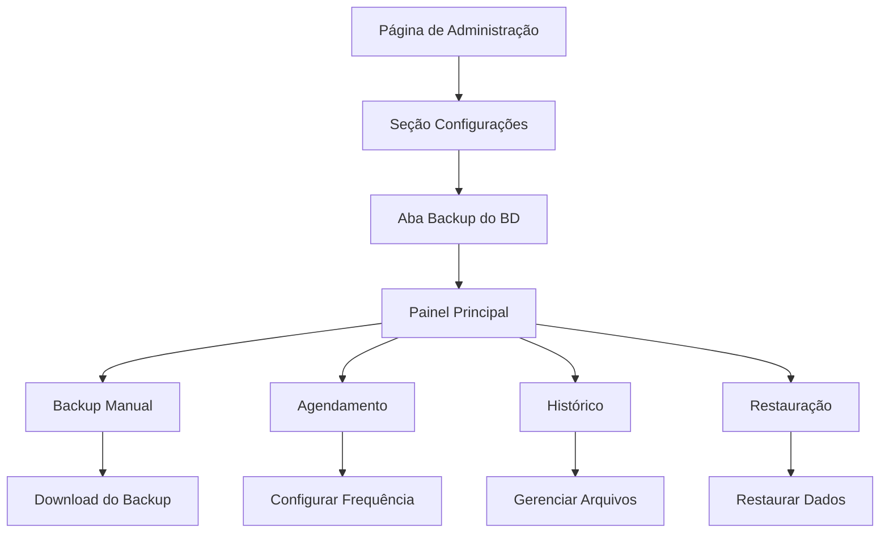

# Funcionalidade de Backup do Banco de Dados - PRD

## 1. Visão Geral do Produto

Sistema de backup e restauração de dados integrado à página de administração do Repal Equipamentos, permitindo aos administradores gerenciar backups do banco de dados de forma segura e automatizada.

- **Objetivo Principal**: Garantir a segurança e integridade dos dados através de backups regulares e restauração quando necessário.
- **Usuários-alvo**: Administradores do sistema com permissões elevadas.
- **Valor de Negócio**: Proteção contra perda de dados, conformidade com boas práticas de segurança e continuidade operacional.

## 2. Funcionalidades Principais

### 2.1 Papéis de Usuário

| Papel | Método de Acesso | Permissões Principais |
|-------|------------------|----------------------|
| Administrador Master | Login com credenciais de admin | Acesso completo a todas as funcionalidades de backup |
| Administrador Limitado | Login com credenciais restritas | Apenas visualização de backups e download |

### 2.2 Módulos Funcionais

O sistema de backup será integrado à seção de configurações da página de administração e incluirá os seguintes módulos principais:

1. **Painel de Backup**: interface principal com visão geral dos backups
2. **Geração de Backup Manual**: criação imediata de backups personalizados
3. **Agendamento Automático**: configuração de backups programados
4. **Histórico de Backups**: listagem e gerenciamento de backups existentes
5. **Restauração de Dados**: interface para restaurar dados a partir de backups
6. **Configurações de Backup**: ajustes gerais do sistema

### 2.3 Detalhes das Páginas

| Nome da Página | Módulo | Descrição da Funcionalidade |
|----------------|--------|----------------------------|
| Painel de Backup | Dashboard Principal | • Exibir estatísticas de backup • Mostrar último backup realizado • Indicadores de status do sistema • Ações rápidas (backup manual, restauração) |
| Backup Manual | Geração de Backup | • Seleção de tabelas específicas • Configuração de formato de exportação • Geração e download do arquivo • Validação de integridade |
| Agendamento | Configuração Automática | • Definir frequência (diário, semanal, mensal) • Configurar horário de execução • Selecionar tabelas para backup automático • Ativar/desativar agendamentos |
| Histórico | Gerenciamento de Backups | • Lista de todos os backups realizados • Informações detalhadas (data, tamanho, status) • Download de backups anteriores • Exclusão de backups antigos |
| Restauração | Recuperação de Dados | • Upload de arquivo de backup • Seleção de dados para restaurar • Preview das alterações • Execução da restauração |
| Configurações | Ajustes do Sistema | • Configurar retenção de backups • Definir local de armazenamento • Configurar notificações • Ajustes de segurança |

## 3. Fluxo Principal de Processos

### Fluxo do Administrador Master:
1. Acessa a seção "Configurações" na página de administração
2. Navega para a aba "Backup do Banco de Dados"
3. Visualiza o painel principal com status dos backups
4. Pode executar backup manual, configurar agendamentos ou restaurar dados
5. Monitora o histórico de backups e gerencia arquivos antigos

### Fluxo do Administrador Limitado:
1. Acessa a seção "Configurações" na página de administração
2. Visualiza apenas o histórico de backups
3. Pode baixar backups existentes para análise local

## 4. Design da Interface do Usuário

### 4.1 Estilo de Design

- **Cores Primárias**: Vermelho (#DC2626) e cinza escuro (#1F2937)
- **Cores Secundárias**: Cinza claro (#F3F4F6) e branco (#FFFFFF)
- **Estilo de Botões**: Arredondados com sombra sutil
- **Fonte**: Inter ou system fonts, tamanhos de 14px a 24px
- **Layout**: Design baseado em cards com navegação por abas
- **Ícones**: Lucide React para consistência visual

### 4.2 Visão Geral do Design das Páginas

| Nome da Página | Módulo | Elementos da UI |
|----------------|--------|-----------------|
| Painel de Backup | Dashboard | • Cards com estatísticas • Indicadores de status coloridos • Botões de ação principais • Timeline do último backup |
| Backup Manual | Geração | • Formulário com checkboxes para seleção de tabelas • Dropdown para formato de exportação • Barra de progresso durante geração • Botão de download destacado |
| Agendamento | Configuração | • Toggle switches para ativar/desativar • Seletores de data/hora • Cards para diferentes frequências • Preview da próxima execução |
| Histórico | Lista | • Tabela responsiva com paginação • Filtros por data e status • Ações inline (download, excluir) • Indicadores visuais de status |
| Restauração | Upload/Restore | • Área de drag-and-drop para upload • Preview dos dados a serem restaurados • Confirmação com modal de segurança • Barra de progresso da restauração |

### 4.3 Responsividade

- **Desktop-first**: Interface otimizada para telas grandes (1024px+)
- **Adaptação Mobile**: Layout responsivo para tablets e smartphones
- **Interação Touch**: Botões e elementos otimizados para toque em dispositivos móveis