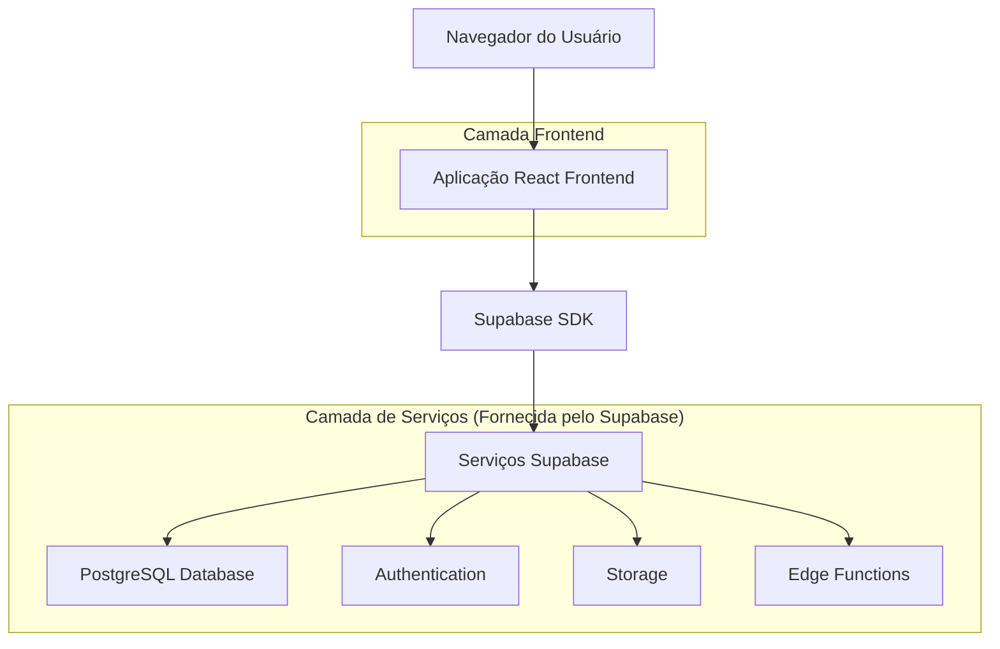
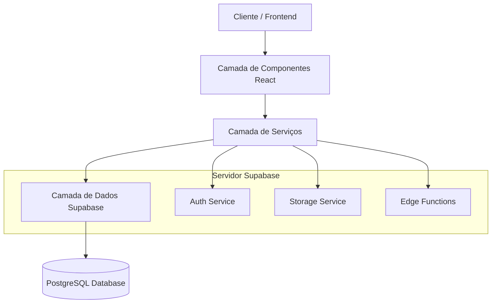
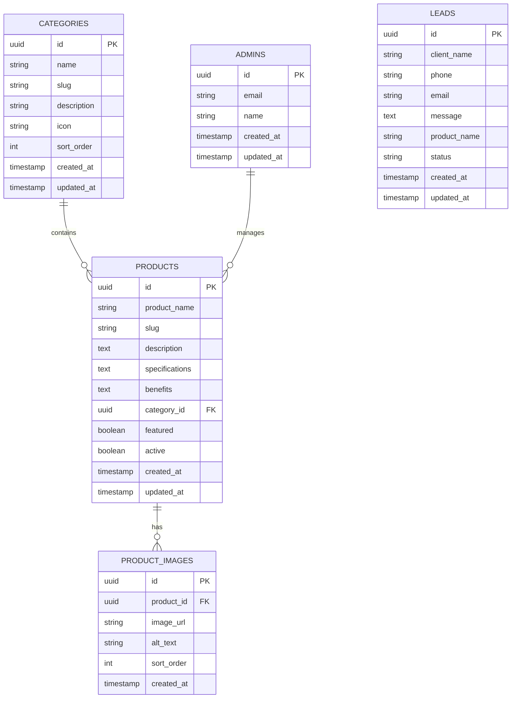

# Documento de Arquitetura Técnica - Site Repal Equipamentos

## 1. Design da Arquitetura



## 2. Descrição das Tecnologias

- **Frontend:** React@18 + TypeScript + Tailwind CSS@3 + Framer Motion + Vite
- **Backend:** Supabase (PostgreSQL + Auth + Storage + Edge Functions)
- **Hospedagem:** Vercel (Frontend) + Supabase (Backend)

## 3. Definições de Rotas

| Rota | Propósito |
|------|----------|
| / | Página inicial com hero impactante e categorias em destaque |
| /categorias | Catálogo completo com filtros e busca |
| /categoria/[slug] | Produtos por categoria específica |
| /produto/[slug] | Página detalhada do produto com galeria e especificações |
| /sobre | História da empresa e cases de sucesso |
| /contato | Informações de contato e formulário |
| /admin | Painel administrativo (protegido por autenticação) |
| /admin/produtos | Gestão de produtos |
| /admin/categorias | Gestão de categorias |
| /admin/leads | Dashboard de leads e orçamentos |

## 4. Definições de API

### 4.1 APIs Principais

**Autenticação de Administradores**
```
POST /auth/v1/token
```

Request:
| Nome do Parâmetro | Tipo | Obrigatório | Descrição |
|-------------------|------|-------------|----------|
| email | string | true | Email do administrador |
| password | string | true | Senha do administrador |

Response:
| Nome do Parâmetro | Tipo | Descrição |
|-------------------|------|----------|
| access_token | string | Token de acesso JWT |
| user | object | Dados do usuário autenticado |

**Gestão de Produtos**
```
GET /rest/v1/products
GET /rest/v1/products?slug=eq.{slug}
POST /rest/v1/products
PUT /rest/v1/products?id=eq.{id}
DELETE /rest/v1/products?id=eq.{id}
```

**Busca de Produto por Slug (SEO-friendly)**
```
GET /rest/v1/products?slug=eq.{slug}&select=*,product_images(*),categories(*)
```

Request:
| Nome do Parâmetro | Tipo | Obrigatório | Descrição |
|-------------------|------|-------------|----------|
| slug | string | true | Slug único do produto para URL SEO-friendly |

Response:
| Nome do Parâmetro | Tipo | Descrição |
|-------------------|------|----------|
| id | uuid | ID único do produto |
| product_name | string | Nome do produto |
| slug | string | Slug para URL |
| description | text | Descrição detalhada |
| specifications | text | Especificações técnicas |
| benefits | text | Benefícios para o negócio |
| product_images | array | Array de imagens do produto |
| categories | object | Dados da categoria |

Example:
```json
{
  "id": "123e4567-e89b-12d3-a456-426614174000",
  "product_name": "Forno Combinado Profissional",
  "slug": "forno-combinado-profissional",
  "description": "Forno de alta performance para restaurantes",
  "specifications": "Capacidade: 10 GN 1/1, Potência: 15kW",
  "benefits": "Aumenta produtividade em 40%, economia de energia",
  "product_images": [
    {
      "image_url": "https://example.com/forno1.jpg",
      "alt_text": "Forno Combinado em ação"
    }
  ],
  "categories": {
    "name": "Equipamentos para Bares e Restaurantes",
    "slug": "bares-restaurantes"
  }
}
```

**Gestão de Leads**
```
POST /rest/v1/leads
GET /rest/v1/leads
```

Request (Criar Lead):
| Nome do Parâmetro | Tipo | Obrigatório | Descrição |
|-------------------|------|-------------|----------|
| client_name | string | true | Nome do cliente |
| phone | string | true | Telefone para WhatsApp |
| email | string | false | Email do cliente |
| message | string | false | Mensagem adicional |
| product_name | string | false | Nome do produto de interesse (capturado automaticamente) |

Example:
```json
{
  "client_name": "João Silva",
  "phone": "+5511999999999",
  "email": "joao@email.com",
  "message": "Gostaria de saber mais sobre equipamentos para padaria",
  "product_name": "Forno Combinado Profissional"
}
```

## 5. Diagrama da Arquitetura do Servidor



## 6. Modelo de Dados

### 6.1 Definição do Modelo de Dados



### 6.2 Linguagem de Definição de Dados (DDL)

**Tabela de Categorias (categories)**
```sql
-- Criar tabela de categorias
CREATE TABLE categories (
    id UUID PRIMARY KEY DEFAULT gen_random_uuid(),
    name VARCHAR(100) NOT NULL,
    slug VARCHAR(100) UNIQUE NOT NULL,
    description TEXT,
    icon VARCHAR(50),
    sort_order INTEGER DEFAULT 0,
    created_at TIMESTAMP WITH TIME ZONE DEFAULT NOW(),
    updated_at TIMESTAMP WITH TIME ZONE DEFAULT NOW()
);

-- Criar índices
CREATE INDEX idx_categories_slug ON categories(slug);
CREATE INDEX idx_categories_sort_order ON categories(sort_order);

-- Dados iniciais das categorias
INSERT INTO categories (name, slug, description, sort_order) VALUES
('Refrigeração Comercial', 'refrigeracao-comercial', 'Bebedouros, Câmaras Frias, Cervejeiras, Expositores, Freezers Comerciais', 1),
('Equipamentos para Bares e Restaurantes', 'bares-restaurantes', 'Batedores, Cafeteiras, Chapas, Fogões, Fornos, Fritadeiras', 2),
('Padaria e Confeitaria', 'padaria-confeitaria', 'Amassadeiras, Batedeiras, Câmaras Climáticas, Fornos Turbo', 3),
('Açougue', 'acougue', 'Amassadores de Carne, Balanças, Balcões Refrigerados, Moedores', 4),
('Utensílios e Utilidades', 'utensilios-utilidades', 'Copos, Cubas, Formas, Panelas Profissionais, Talheres', 5),
('Mobiliário em Inox', 'mobiliario-inox', 'Bancadas, Carrinhos, Estantes, Pias de Assepsia', 6),
('Peças e Componentes', 'pecas-componentes', 'Compressores, Evaporadores, Válvulas, Ventiladores', 7);
```

**Tabela de Produtos (products)**
```sql
-- Criar tabela de produtos
CREATE TABLE products (
    id UUID PRIMARY KEY DEFAULT gen_random_uuid(),
    product_name VARCHAR(200) NOT NULL,
    slug VARCHAR(200) UNIQUE NOT NULL,
    description TEXT,
    specifications TEXT,
    benefits TEXT,
    category_id UUID REFERENCES categories(id),
    featured BOOLEAN DEFAULT false,
    active BOOLEAN DEFAULT true,
    created_at TIMESTAMP WITH TIME ZONE DEFAULT NOW(),
    updated_at TIMESTAMP WITH TIME ZONE DEFAULT NOW()
);

-- Criar índices
CREATE INDEX idx_products_category_id ON products(category_id);
CREATE INDEX idx_products_slug ON products(slug);
CREATE INDEX idx_products_featured ON products(featured);
CREATE INDEX idx_products_active ON products(active);
```

**Tabela de Imagens de Produtos (product_images)**
```sql
-- Criar tabela de imagens
CREATE TABLE product_images (
    id UUID PRIMARY KEY DEFAULT gen_random_uuid(),
    product_id UUID REFERENCES products(id) ON DELETE CASCADE,
    image_url TEXT NOT NULL,
    alt_text VARCHAR(200),
    sort_order INTEGER DEFAULT 0,
    created_at TIMESTAMP WITH TIME ZONE DEFAULT NOW()
);

-- Criar índices
CREATE INDEX idx_product_images_product_id ON product_images(product_id);
CREATE INDEX idx_product_images_sort_order ON product_images(sort_order);
```

**Tabela de Leads (leads)**
```sql
-- Criar tabela de leads
CREATE TABLE leads (
    id UUID PRIMARY KEY DEFAULT gen_random_uuid(),
    client_name VARCHAR(100) NOT NULL,
    phone VARCHAR(20) NOT NULL,
    email VARCHAR(255),
    message TEXT,
    product_name VARCHAR(200),
    status VARCHAR(20) DEFAULT 'novo' CHECK (status IN ('novo', 'contato', 'orcado', 'fechado', 'perdido')),
    created_at TIMESTAMP WITH TIME ZONE DEFAULT NOW(),
    updated_at TIMESTAMP WITH TIME ZONE DEFAULT NOW()
);

-- Criar índices
CREATE INDEX idx_leads_status ON leads(status);
CREATE INDEX idx_leads_created_at ON leads(created_at DESC);
CREATE INDEX idx_leads_product_name ON leads(product_name);
```

**Permissões Supabase**
```sql
-- Permissões para usuários anônimos (público)
GRANT SELECT ON categories TO anon;
GRANT SELECT ON products TO anon;
GRANT SELECT ON product_images TO anon;
GRANT INSERT ON leads TO anon;

-- Permissões para usuários autenticados (administradores)
GRANT ALL PRIVILEGES ON categories TO authenticated;
GRANT ALL PRIVILEGES ON products TO authenticated;
GRANT ALL PRIVILEGES ON product_images TO authenticated;
GRANT ALL PRIVILEGES ON leads TO authenticated;
```

## 7. Otimização SEO com Slugs

### 7.1 Geração de Slugs

Para garantir URLs SEO-friendly, os slugs devem seguir estas diretrizes:

**Regras de Geração:**
- Converter para minúsculas
- Substituir espaços por hífens (-)
- Remover caracteres especiais e acentos
- Limitar a 200 caracteres
- Garantir unicidade no banco de dados

**Exemplo de Função de Geração:**
```javascript
function generateSlug(name) {
  return name
    .toLowerCase()
    .normalize('NFD')
    .replace(/[\u0300-\u036f]/g, '') // Remove acentos
    .replace(/[^a-z0-9\s-]/g, '') // Remove caracteres especiais
    .replace(/\s+/g, '-') // Substitui espaços por hífens
    .replace(/-+/g, '-') // Remove hífens duplicados
    .trim('-'); // Remove hífens das extremidades
}
```

### 7.2 URLs SEO-Friendly

**Estrutura de URLs:**
- Produtos: `/produto/forno-combinado-profissional`
- Categorias: `/categoria/bares-restaurantes`
- Busca: `/busca?q=forno+combinado`

**Benefícios SEO:**
- URLs descritivas melhoram ranking nos motores de busca
- Facilita compartilhamento em redes sociais
- Melhora experiência do usuário
- Aumenta taxa de cliques (CTR) nos resultados de busca

### 7.3 Implementação no Frontend

**Navegação por Slug:**
```javascript
// React Router com slug
<Route path="/produto/:slug" element={<ProductPage />} />

// Hook para buscar produto por slug
const { slug } = useParams();
const { data: product } = useQuery(['product', slug], () => 
  supabase
    .from('products')
    .select('*, product_images(*), categories(*)')
    .eq('slug', slug)
    .single()
);
```

### 7.4 Integração Leads com Slugs

**Fluxo de Geração de Leads:**
1. Usuário navega para `/produto/forno-combinado-profissional`
2. Frontend busca produto por slug e obtém o `product_id`
3. Ao solicitar orçamento, usa o `product_id` interno para manter integridade referencial
4. URLs permanecem SEO-friendly para o usuário

**Implementação do Formulário de Lead com Captura Automática:**
```javascript
// Componente de solicitação de orçamento
function LeadForm({ product }) {
  const handleSubmit = async (formData) => {
    const leadData = {
      client_name: formData.client_name,
      phone: formData.phone,
      email: formData.email,
      message: formData.message || `Interesse no produto: ${product.product_name}`,
      product_name: product.product_name // Captura automática do nome do produto
    };
    
    await supabase.from('leads').insert(leadData);
    
    // Redireciona para WhatsApp com informações do produto
    const whatsappUrl = `https://wa.me/5511999999999?text=Olá! Tenho interesse no ${product.product_name}. Vim através do site: ${window.location.href}`;
    window.open(whatsappUrl, '_blank');
  };
  
  return (
    <form onSubmit={handleSubmit}>
      {/* Campos do formulário */}
      <input type="hidden" value={product.product_name} name="product_name" />
    </form>
  );
}
```

**Vantagens desta Abordagem:**
- **SEO:** URLs amigáveis para motores de busca
- **UX:** URLs legíveis e compartilháveis
- **Integridade:** Relacionamentos de banco mantidos com UUIDs
- **Performance:** Índices otimizados tanto para slug quanto para ID
- **Flexibilidade:** Slugs podem ser alterados sem quebrar referências internas

## 8. Captura Automática do Product_Name

### 8.1 Funcionalidade

Quando um cliente clica no botão de solicitação de orçamento via WhatsApp em uma página de produto específica, o sistema automaticamente captura e inclui o `product_name` no JSON enviado para a API de leads.

### 8.2 Implementação Técnica

**Fluxo de Captura:**
1. Cliente navega para página do produto (ex: `/produto/forno-combinado-profissional`)
2. Sistema carrega dados do produto incluindo `product_name`
3. Ao clicar em "Solicitar Orçamento", o `product_name` é automaticamente incluído no formulário
4. JSON enviado para API contém o campo `product_name` preenchido
5. Lead é salvo no banco com referência ao produto de interesse

**Código de Exemplo:**
```javascript
// Hook para capturar produto da página atual
const useProductContext = () => {
  const { slug } = useParams();
  const [product, setProduct] = useState(null);
  
  useEffect(() => {
    if (slug) {
      // Busca produto por slug
      supabase
        .from('products')
        .select('*')
        .eq('slug', slug)
        .single()
        .then(({ data }) => setProduct(data));
    }
  }, [slug]);
  
  return product;
};

// Componente do botão WhatsApp
function WhatsAppButton() {
  const product = useProductContext();
  
  const handleWhatsAppClick = async () => {
    // Captura dados do formulário (se houver)
    const leadData = {
      client_name: 'Cliente via WhatsApp',
      phone: 'A ser informado',
      product_name: product?.product_name, // Captura automática
      message: `Interesse via WhatsApp no produto: ${product?.product_name}`
    };
    
    // Salva lead no banco
    await supabase.from('leads').insert(leadData);
    
    // Abre WhatsApp
    const whatsappUrl = `https://wa.me/5511999999999?text=Olá! Tenho interesse no ${product?.product_name}`;
    window.open(whatsappUrl, '_blank');
  };
  
  return (
    <button onClick={handleWhatsAppClick}>
      Solicitar Orçamento via WhatsApp
    </button>
  );
}
```

### 8.3 Benefícios

- **Rastreabilidade:** Permite identificar quais produtos geram mais leads
- **Automação:** Elimina necessidade de preenchimento manual
- **Analytics:** Facilita relatórios de performance por produto
- **UX:** Processo mais rápido para o cliente
- **Dados Estruturados:** Informações organizadas para análise de vendas
```