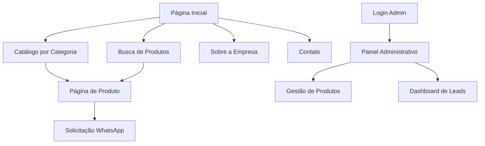

# Documento de Requisitos de Produto - Site Repal Equipamentos

## 1. Visão Geral do Produto

O novo site da Repal Equipamentos será uma plataforma digital de alta performance voltada para empreendedores visionários que desejam elevar o nível de seus negócios gastronômicos. O site transmitirá sensação de poder, crescimento e conquista, posicionando os equipamentos profissionais como investimentos estratégicos para o sucesso empresarial.

- **Objetivo Principal:** Conectar emocionalmente com empreendedores ambiciosos, demonstrando que investir em equipamentos profissionais é investir no crescimento e reconhecimento do negócio.
- **Valor de Mercado:** Posicionar a Repal como parceira estratégica para transformação e expansão de negócios gastronômicos de alta performance.

## 2. Funcionalidades Principais

### 2.1 Perfis de Usuário

| Perfil | Método de Acesso | Permissões Principais |
|--------|------------------|----------------------|
| Visitante | Acesso direto ao site | Navegar catálogo, solicitar orçamentos via WhatsApp |
| Administrador | Login com email/senha | Gerenciar produtos, categorias, leads e conteúdo |

### 2.2 Módulos de Funcionalidade

Nosso site de equipamentos gastronômicos de alta performance consiste nas seguintes páginas principais:

1. **Página Inicial**: seção hero impactante, navegação por categorias, depoimentos de sucesso, call-to-actions emocionais
2. **Catálogo de Produtos**: filtros avançados, cards de produtos com foco em performance, botões de orçamento WhatsApp
3. **Página de Produto**: galeria de imagens em ação, especificações técnicas, benefícios de negócio, solicitação de orçamento
4. **Sobre a Empresa**: história de sucesso, expertise, cases de clientes
5. **Contato**: múltiplos canais, formulário de contato, localização
6. **Painel Administrativo**: gestão de produtos, categorias, leads e conteúdo

### 2.3 Detalhes das Páginas

| Nome da Página | Nome do Módulo | Descrição da Funcionalidade |
|----------------|----------------|-----------------------------|
| Página Inicial | Seção Hero | Apresentar mensagem impactante "Transforme sua cozinha em uma verdadeira potência gastronômica" com CTA principal |
| Página Inicial | Categorias em Destaque | Exibir 7 categorias principais com imagens envolventes e navegação direta |
| Página Inicial | Cases de Sucesso | Mostrar resultados concretos: mais clientes, maior produção, economia de tempo |
| Página Inicial | Frases de Autoridade | Destacar "O equipamento certo faz seu negócio crescer mais rápido" e "Alta performance que gera resultados de verdade" |
| Catálogo | Sistema de Filtros | Filtrar por categoria, tipo de negócio, faixa de investimento |
| Catálogo | Cards de Produto | Exibir equipamentos com foco em performance, tecnologia e design robusto |
| Catálogo | Busca Inteligente | Buscar por nome, categoria ou benefício específico |
| Produto | Galeria Visual | Mostrar equipamentos em ação com imagens de alta qualidade |
| Produto | Especificações Técnicas | Detalhar capacidade, eficiência, produtividade |
| Produto | Benefícios de Negócio | Conectar características técnicas com resultados empresariais |
| Produto | Orçamento WhatsApp | Botão verde destacado para solicitação direta via WhatsApp |
| Administração | Gestão de Produtos | Criar, editar, excluir produtos com upload de múltiplas imagens |
| Administração | Gestão de Categorias | Organizar estrutura do catálogo conforme especificações |
| Administração | Dashboard de Leads | Visualizar e gerenciar solicitações de orçamento |

## 3. Fluxo Principal de Processos

**Fluxo do Empreendedor Visionário:**
1. Acessa o site e é impactado pela mensagem de transformação
2. Navega pelas categorias identificando oportunidades de crescimento
3. Explora produtos específicos através de URLs SEO-friendly (ex: /produto/forno-combinado-profissional)
4. Visualiza benefícios concretos e especificações técnicas
5. Solicita orçamento via WhatsApp com mensagem pré-preenchida
6. Recebe atendimento personalizado da equipe Repal

**Fluxo do Administrador:**
1. Acessa painel administrativo com autenticação
2. Gerencia catálogo de produtos e categorias
3. Acompanha leads gerados pelo site
4. Atualiza conteúdo e promoções

## 4. Design da Interface do Usuário

### 4.1 Estilo de Design

**Paleta de Cores:**
- **Vermelho Escuro Primário:** #8B0000 (poder, determinação, liderança)
- **Azul Marinho Secundário:** #000080 (confiança, profissionalismo, estabilidade)
- **Branco:** #FFFFFF (clareza, modernidade, sofisticação)
- **Cinza Texto:** #333333 (legibilidade, elegância)
- **Verde WhatsApp:** #25D366 (ação, conversão, contato direto)

**Tipografia:**
- **Títulos Impactantes:** Fontes bold e modernas (Montserrat Bold, Roboto Black)
- **Corpo do Texto:** Fontes elegantes e legíveis (Open Sans, Lato)
- **Tamanhos:** H1 (48px+), H2 (36px), H3 (24px), Corpo (16px)

**Estilo Visual:**
- **Botões:** Design 3D com gradientes, bordas arredondadas, efeitos hover
- **Layout:** Grid moderno com cards, navegação superior fixa
- **Ícones:** Estilo minimalista com foco em performance e crescimento
- **Animações:** Transições suaves que reforçam sensação de poder

### 4.2 Visão Geral do Design das Páginas

| Nome da Página | Nome do Módulo | Elementos de UI |
|----------------|----------------|----------------|
| Página Inicial | Seção Hero | Background com equipamento em ação, título impactante em vermelho escuro, CTA em destaque com gradiente |
| Página Inicial | Categorias | Cards com hover effects, imagens de alta qualidade, títulos em azul marinho |
| Página Inicial | Depoimentos | Layout em carrossel, aspas em vermelho, fundos em cinza claro |
| Catálogo | Filtros | Sidebar com checkboxes estilizados, cores da marca, animações suaves |
| Catálogo | Grid de Produtos | Cards com shadow, imagens em destaque, botões de ação em verde WhatsApp |
| Produto | Galeria | Slider principal com thumbnails, zoom on hover, indicadores visuais |
| Produto | Especificações | Tabelas estilizadas, ícones de performance, destaque para benefícios |
| Produto | CTA WhatsApp | Botão flutuante fixo, animação pulsante, texto persuasivo |

### 4.3 URLs SEO-Friendly

O site utilizará **slugs únicos** para melhorar o SEO e experiência do usuário:
- **Produtos:** `/produto/[slug]` (ex: `/produto/forno-combinado-profissional`)
- **Categorias:** `/categoria/[slug]` (ex: `/categoria/bares-restaurantes`)
- **Benefícios:** URLs descritivas que facilitam compartilhamento e indexação
- **Navegação:** Links internos otimizados para motores de busca

### 4.4 Responsividade

O site será **mobile-first** com adaptação completa para desktop, incluindo:
- **Touch optimization** para navegação em dispositivos móveis
- **Imagens responsivas** que mantêm impacto visual em todas as telas
- **Navegação adaptativa** com menu hamburger em mobile
- **CTAs otimizados** para conversão em dispositivos móveis